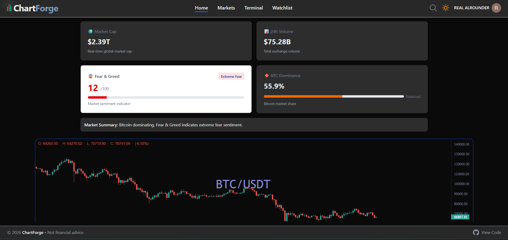
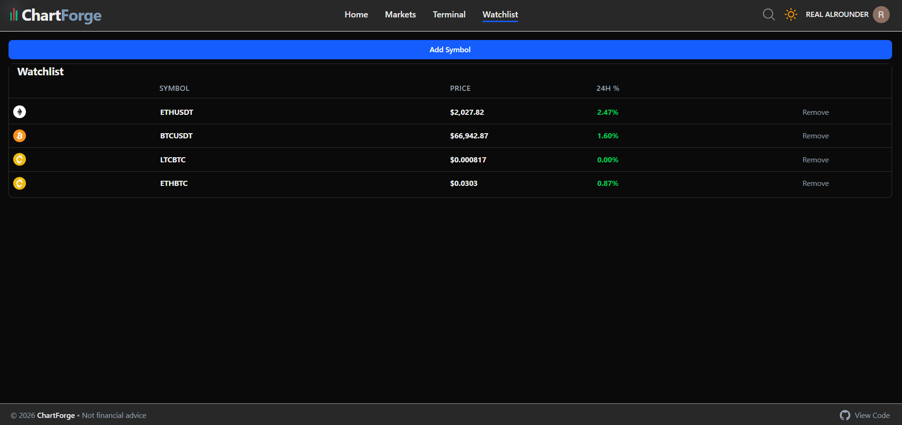
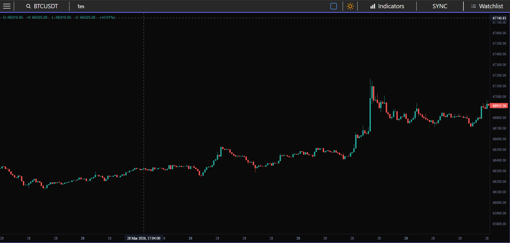
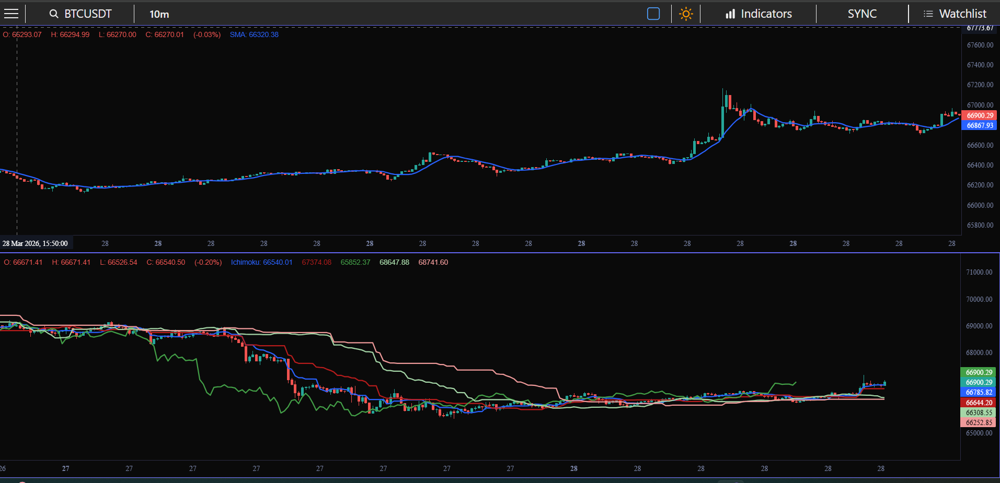

🚀 ChartForge

A professional crypto trading dashboard with real-time market data, interactive charts, and multi-chart layouts.

🌐 Live Demo

👉 https://chartforge-production-c132.up.railway.app/

📊 Features
⚡ Real-time Binance WebSocket data
📈 Interactive candlestick charts (TradingView Lightweight Charts)
🧠 Multi-chart layout system
🔄 Symbol & timeframe sync across charts
📋 Watchlist with live updates
🚀 High-performance UI (virtualized tables)
🛠 Tech Stack
Frontend: Next.js (App Router), React, TailwindCSS
State Management: Zustand + Immer
Charts: TradingView Lightweight Charts,Lightweight Charts React Component
Data: Binance WebSocket API
Backend & DB: Supabase
Auth: Clerk

⚙️ Environment Variables

Create a .env.local file in the root of your project and add the following:

# 🟢 Supabase

NEXT_PUBLIC_SUPABASE_URL=your_supabase_url
NEXT_PUBLIC_SUPABASE_ANON_KEY=your_supabase_anon_key
SUPABASE_SERVICE_ROLE_KEY=your_service_role_key

# 🔐 Clerk Authentication

NEXT_PUBLIC_CLERK_PUBLISHABLE_KEY=your_clerk_publishable_key
CLERK_SECRET_KEY=your_clerk_secret_key
CLERK_WEBHOOK_SECRET=your_clerk_webhook_secret

# 🔗 Clerk Routes

NEXT_PUBLIC_CLERK_SIGN_IN_URL=/sign-in
NEXT_PUBLIC_CLERK_SIGN_UP_URL=/sign-up
NEXT_PUBLIC_CLERK_SIGN_IN_FALLBACK_REDIRECT_URL=/
NEXT_PUBLIC_CLERK_SIGN_UP_FALLBACK_REDIRECT_URL=/

# 📡 Binance API

BINANCE_REST_BASE_URL=https://api.binance.com/api/v3/klines

🚀 Getting Started

1. Clone the repository
   git clone https://github.com/your-username/chartforge.git
   cd chartforge
2. Install dependencies
   npm install
3. Run development server
   npm run dev
   📸 Screenshots

## 📸 Screenshots

### 📊 Dashboard

### 📋 Watchlist

### 📈 Charts

🧠 Learnings
Handling real-time data with WebSockets
Managing high-frequency updates using Zustand
Building scalable chart systems like TradingView
Handling API rate limits and region restrictions
⚠️ Disclaimer

This project is for educational purposes only.
Not financial advice.

⭐ Contribute

Feel free to fork this repo and contribute!

👨‍💻 Author

Built with passion by Shis Momin 🚀
